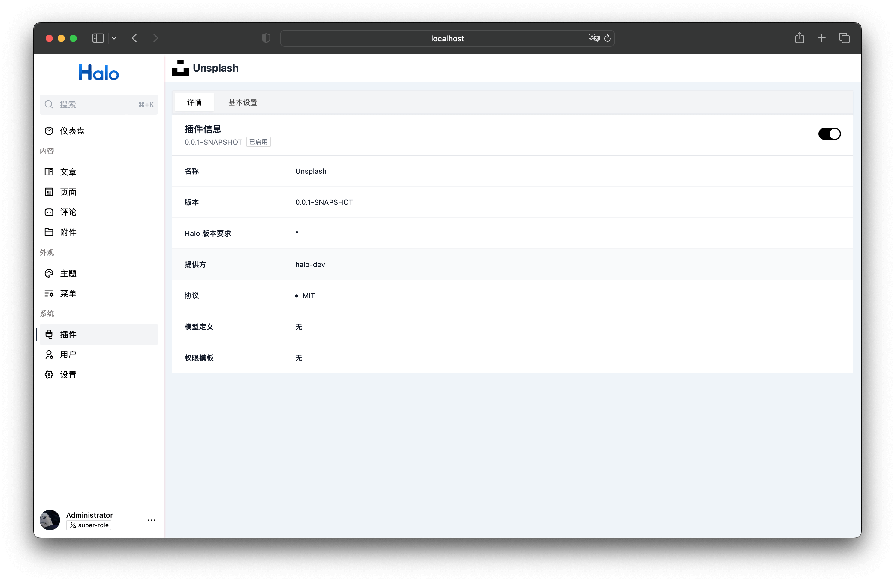
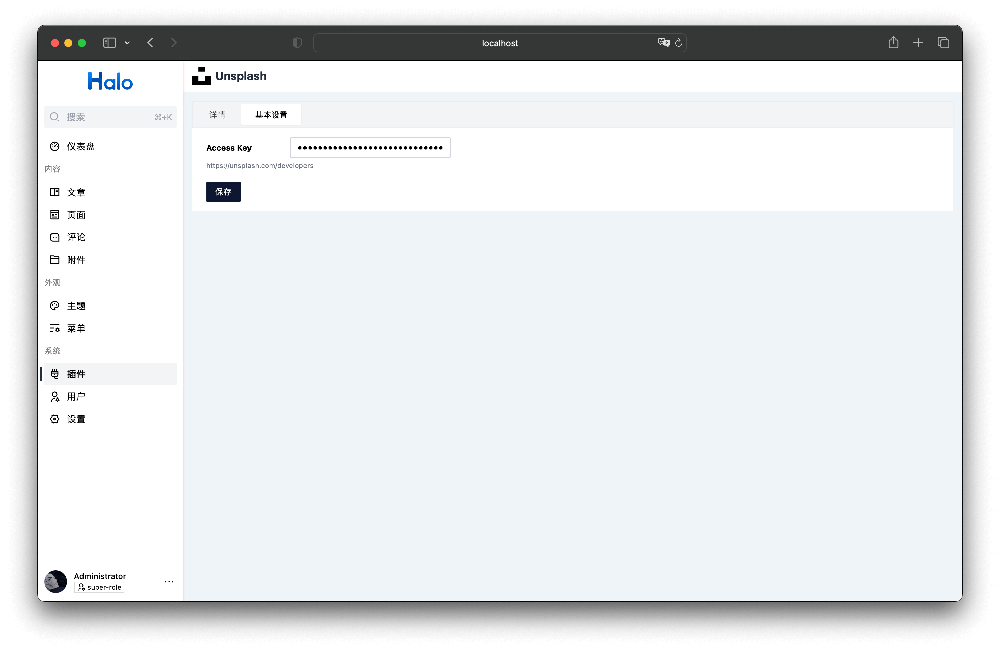
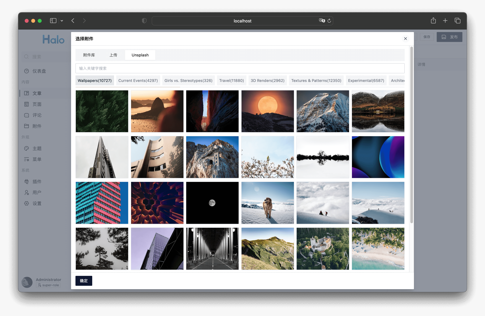
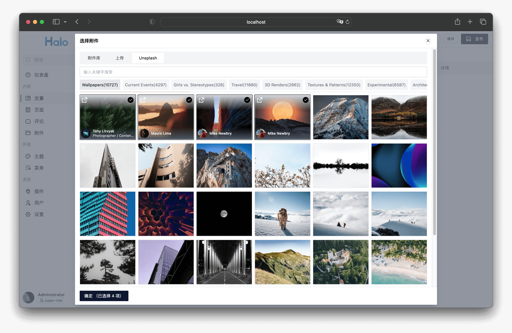
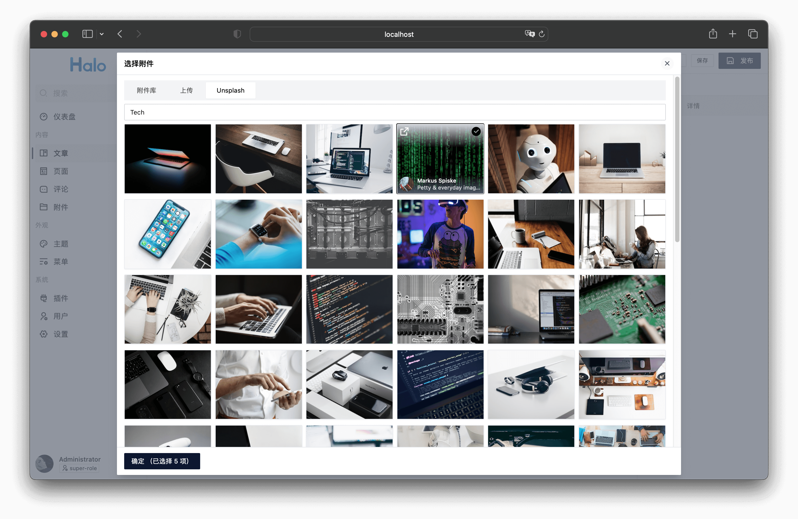
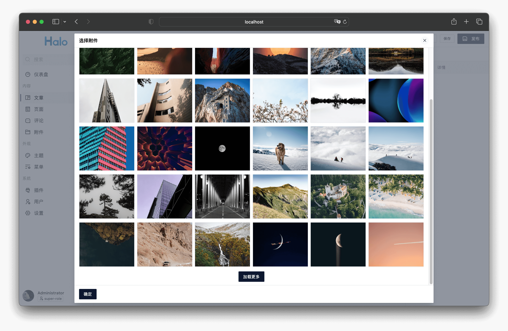

# plugin-unsplash

Halo 2.0 接入 [Unsplash](https://unsplash.com/) 的插件

## 开发环境

```bash
git clone https://github.com/halo-sigs/plugin-unsplash
```

```bash
cd path/to/plugin-unsplash
```

```bash
./gradlew build
```

修改 Halo 配置文件：

```yaml
halo:
  plugin:
    runtime-mode: development
    classes-directories:
      - "build/classes"
      - "build/resources"
    lib-directories:
      - "libs"
    fixedPluginPath:
      - "/path/to/plugin-unsplash"
```

## 安装与使用

1. 进入 [Releases](https://github.com/halo-sigs/plugin-unsplash/releases) 下载最新版本的 JAR 文件。
2. 在 Halo 后台的插件管理上传 JAR 文件进行安装。
3. 启动该插件之后，需要在设置中配置 Unsplash 的 Access Key，详情可查阅：<https://unsplash.com/developers>
4. 完成 Access Key 配置后，在后台任意位置选择附件的弹框中选择 Unsplash 选项卡，即可使用 Unsplash 的图片。

## 声明

此插件所提供的内容均来自 [Unsplash](https://unsplash.com/)。

## 截图

|  |  |  |
| ------------------------------------ | ------------------------------------ | ------------------------------------ |
|  |  |  |
